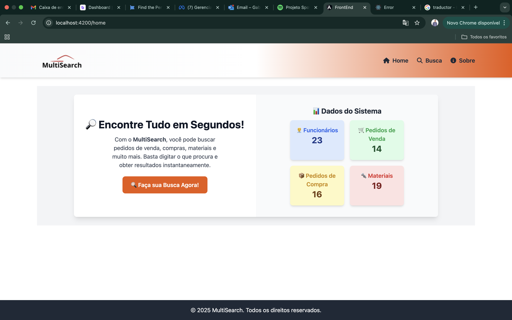

# MultiSearch

**README.md** explicando os detalhes do **front-end (Angular)** e **back-end (Node.js com Fastify)**, além de instruções para rodar o projeto e uma **imagem de exemplo**.

---

## **🔍 Projeto MultiSearch**
Um sistema de busca avançada desenvolvido com **Angular** no front-end e **Node.js (Fastify)** no back-end. Permite pesquisar e visualizar informações estruturadas de pedidos de venda, pedidos de compra, materiais, equipamentos e mão de obra.

 <!-- Substitua pelo caminho correto da imagem -->

---

## **📌 Funcionalidades**
✅ Busca rápida e inteligente em diferentes categorias  
✅ Filtro de categorias para refinar os resultados  
✅ Paginação para melhor navegação entre os dados  
✅ Exibição de detalhes completos ao clicar em um item  
✅ Interface responsiva e otimizada  

---

## **🛠 Tecnologias Utilizadas**
### **🔷 Front-end (Angular)**
- Angular 15+
- TypeScript
- Tailwind CSS
- FontAwesome (ícones)

### **🔷 Back-end (Node.js + Fastify)**
- Fastify (framework leve e otimizado)
- Lodash (para normalização de texto)
- FS-Extra (leitura de arquivos JSON)

---

## **🚀 Como Rodar o Projeto**
### **🔹 Clonando o repositório**
```bash
git clone https://github.com/seu-usuario/multisearch.git
cd multisearch
```

---

## **🖥️ Iniciando o Back-end (Fastify)**
### **1️⃣ Acesse a pasta do back-end**
```bash
cd back-end
```

### **2️⃣ Instale as dependências**
```bash
npm install
```

### **3️⃣ Inicie o servidor Fastify**
```bash
npm run dev
```
- O servidor será iniciado em `http://localhost:3000`
- A API estará disponível na rota `http://localhost:3000/search?query=mesa`

---

## **🌐 Iniciando o Front-end (Angular)**
### **1️⃣ Acesse a pasta do front-end**
```bash
cd ../front-end
```

### **2️⃣ Instale as dependências**
```bash
npm install
```

### **3️⃣ Inicie o servidor Angular**
```bash
ng serve --open
```
- O projeto será iniciado em `http://localhost:4200`
- A interface exibirá o campo de busca e os filtros de categorias.

---

## **🛠 Estrutura do Projeto**
```
multisearch/
│── back-end/              # API Node.js com Fastify
│   ├── src/
│   │   ├── controllers/   # Lógica de busca na API
│   │   ├── routes/        # Definição das rotas da API
│   │   ├── data/          # Arquivos JSON com os dados
│   ├── package.json       # Dependências do back-end
│   ├── server.ts          # Arquivo principal do servidor
│
│── front-end/             # Aplicação Angular
│   ├── src/
│   │   ├── app/
│   │   │   ├── components/ # Componentes reutilizáveis
│   │   │   ├── pages/      # Páginas do projeto
│   │   │   ├── services/   # Serviços para consumir a API
│   ├── angular.json        # Configuração do Angular
│   ├── package.json        # Dependências do front-end
│
│── README.md               # Documentação do projeto
│── assets/                  # Imagens para o README
```

---

## **📢 Como Utilizar**
1️⃣ **Digite um termo de pesquisa** no campo de busca.  
2️⃣ **Escolha uma ou mais categorias** para filtrar os resultados.  
3️⃣ **Visualize os resultados** organizados por categoria.  
4️⃣ **Clique no ID** de um item para ver mais detalhes.  
5️⃣ **Use a paginação** para navegar pelos registros.

---

## **📜 API - Exemplo de Resposta**
```json
{
  "sales_orders": [
    {
      "SalesOrderID": 20450,
      "Customer": "Toughzap",
      "DeliveryDate": "01/09/2018",
      "MaterialID": "MR2X1",
      "MaterialName": "Mesa Retangular 2m x 1m",
      "Quantity": 20,
      "TotalValue": 2000
    }
  ],
  "purchase_orders": [],
  "materials": [],
  "equipments": [],
  "workforce": []
}
```

---

## **📌 Contribuindo**
Sinta-se à vontade para contribuir com melhorias para este projeto!  
1️⃣ **Faça um fork do repositório**  
2️⃣ **Crie uma nova branch**: `git checkout -b minha-feature`  
3️⃣ **Commit suas alterações**: `git commit -m "Nova funcionalidade"`  
4️⃣ **Envie para o repositório**: `git push origin minha-feature`  
5️⃣ **Abra um Pull Request**  

---

## **📄 Licença**
Este projeto está sob a licença **MIT**.  

📌 Desenvolvido com 💻 e ☕ por **[Gabriel Anselmo Ramos]** 🚀  

---

### 🔥 **Agora seu README está pronto!**
Ele contém:  
✅ **Descrição clara do projeto**  
✅ **Tecnologias utilizadas**  
✅ **Instruções detalhadas para rodar**  
✅ **Exemplo de uso da API**  
✅ **Guia de contribuição**  

Se precisar de ajustes ou quiser adicionar mais informações, me avise! 🚀🎯